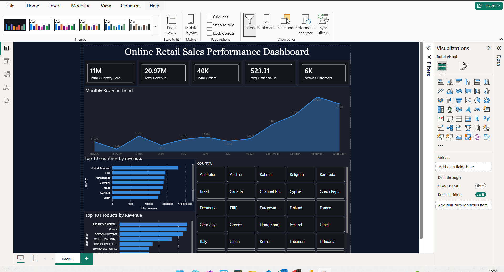

# Retail Sales Data Analysis

## Project Overview
This project analyzes retail sales data to understand sales performance, customer behavior, and product category trends.  
The goal is to extract useful business insights and present them through Python analysis and a Power BI dashboard.

## Tools Used
- Python
- Pandas
- Matplotlib
- Power BI
- Jupyter Notebook

## Dataset
The dataset contains retail sales transactions, including customer information, product categories, dates, quantities, and sales values.

## Analysis Process
1. Loaded the dataset using Python.
2. Checked the structure of the data.
3. Cleaned missing or incorrect values.
4. Analyzed total sales and revenue trends.
5. Compared performance by product category.
6. Created visualizations using Python.
7. Built a Power BI dashboard to present the results.

## Key Questions Answered
- What is the total revenue?
- Which product category performs best?
- How do sales change over time?
- What are the main customer purchasing patterns?
- Which insights can help improve business decisions?

## Key Insights
- The project identified important sales trends over time.
- Product category performance helped show which categories generate more revenue.
- The dashboard makes it easier to understand revenue, customer behavior, and product performance.

## Business Recommendation
The business should focus more on the best-performing product categories and monitor monthly sales trends to improve inventory planning, marketing decisions, and revenue growth.

## Dashboard Preview

## Files in This Repository
- `retail_sales_analysis.ipynb` — Python notebook for data cleaning and analysis.
- `cleaned_retail_sales.csv` — Cleaned dataset used for analysis.
- `retail_analysis_dashboard.png` — Dashboard screenshot.
- `README.md` — Project documentation.

## What I Learned
Through this project, I practiced data cleaning, exploratory data analysis, visualization, and creating a business-focused dashboard.
